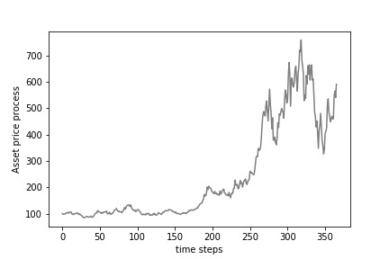
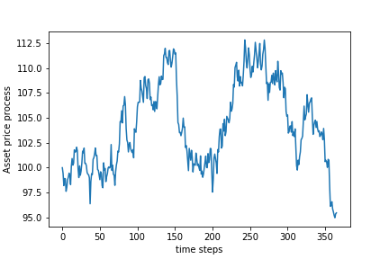

[](http://quantlet.de/)

## [](http://quantlet.de/) **HedgingCrix_models_paths** [](http://quantlet.de/)

```yaml

Name of QuantLet : HedgingCrix_models_paths

Published in : 'Hedging under jump induced market incompleteness'

Description : "Simulation of Euler discretized hedge models including the Geometric Brownian Motion (Black-Scholes), Merton Jump
Diffusion and the dynamics under Heston's Stochastic Volatility Model."

Keywords : 'Black Scholes, Merton jump diffusion, Stochastic Volatility, Heston Model, volatility, process, Euler discretization, jumps'

Author: 'Jovanka Lili Matic'

Submitted : 'Mo, 22 July 2019'

Output:   'Hedge models asset paths'

```






### [IPYNB Code: HedgingCrix_models_paths.ipynb](HedgingCrix_models_paths.ipynb)


automatically created on 2019-08-16